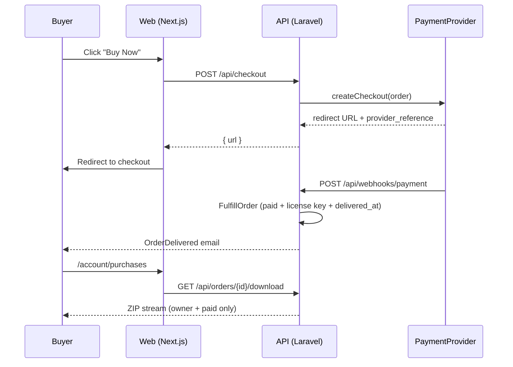

# StackMart

**A curated marketplace for buying and selling ready-made micro-SaaS products, web apps, and codebases.**

Buyers browse vetted listings, check live demos and repositories, pay, and instantly receive a license key and a secure download. Sellers submit their projects through a public form, and an admin reviews, approves, and publishes them from a full back-office panel.

The whole product — from an empty repository to a working, tested, end-to-end marketplace — was designed and shipped in **7 days** (5 build days + 2 testing days).

---

## Highlights

- **End-to-end commerce loop** — Buy Now → checkout → payment webhook → automatic fulfillment (license key + delivery email) → authenticated ZIP download → purchase history.
- **Payment-gateway agnostic** — the entire checkout runs behind a single `PaymentProvider` contract. Swapping in a real gateway is one class plus environment variables; no other code changes.
- **Idempotent fulfillment** — duplicate webhooks never double-fulfill an order (unique `provider_reference` + row-locked status guard).
- **Secure deliverables** — product files live on a private disk and are only streamed to the paying owner.
- **Admin-curated catalog** — every listing passes through a review workflow before it goes live.
- **Production-grade frontend** — SSR/ISR pages, URL-driven filters, full SEO, responsive on every screen size, accessible, lint-clean.

---

## Features

### Buyers
- Home page with featured listings, categories, and how-it-works section
- Marketplace with **full-text search**, category / tech-stack / price filters, sorting, and pagination — all encoded in the URL, so every search is shareable
- Listing page with gallery, business metrics (MRR, users, profit), tech stack, what's included, and FAQ
- **Live Demo** and **View Repository** buttons, with automatic provider icons (GitHub, GitLab, Bitbucket, self-hosted)
- Account area with purchase history, copyable license keys, and one-click downloads

### Sellers
- Public submission form with project details, pricing, and file uploads
- Email confirmation on submission
- Payout on sale with a flat commission model
- Selling features can be switched off entirely with a single feature flag

### Admins (`/admin`)
- Full back office for products, categories, orders, submissions, and users
- Submission review workflow: `new → in review → approved / rejected`, with internal notes and a one-click "create listing" path
- Dashboard with revenue, orders, payouts owed, and review-queue widgets
- Manual refunds and payout tracking

### Accounts & Security
- Register, login, logout, forgot / reset password
- Bearer-token API authentication
- Rate-limited auth endpoints, no user enumeration
- Hardened webhook, admin, and submission endpoints, plus security headers

---

## Tech Stack

| Layer | Technology |
|---|---|
| **Backend API** | Laravel 11 · PHP 8.3 |
| **Authentication** | Laravel Sanctum (personal access tokens) |
| **Admin panel** | Filament v3 |
| **Database** | MySQL 8 (FULLTEXT search, JSON columns) |
| **Testing** | Pest (feature tests on an isolated test database) |
| **Frontend** | Next.js 16 (App Router) · React 19 · TypeScript |
| **Styling / UI** | Tailwind CSS v4 · shadcn/ui · custom design tokens |
| **Data fetching** | TanStack Query |
| **Client state** | Zustand (one small auth store) |
| **Tooling** | pnpm · Node 24 · ESLint |

---

## Architecture

A monorepo with two independent applications that talk only through a versioned JSON API:

```
stackmart/
├── api/                    # Laravel 11 — REST API + Filament admin
│   ├── app/
│   │   ├── Actions/        # FulfillOrder, payment event handling
│   │   ├── Filament/       # Admin resources + dashboard widgets
│   │   ├── Http/           # Controllers, Form Requests, API Resources
│   │   ├── Models/
│   │   └── Payments/       # PaymentProvider contract + implementations
│   ├── routes/
│   │   ├── catalog.php     # products, categories, submissions (public)
│   │   ├── auth.php        # register / login / logout / me / password reset
│   │   └── commerce.php    # checkout, orders, download, webhook
│   └── tests/Feature/      # Pest feature tests
└── web/                    # Next.js App Router frontend
    └── src/
        ├── app/            # (public), (auth), (account), checkout route groups
        ├── components/
        ├── lib/            # API client, helpers
        └── store/          # auth store
```

### Order flow



### API overview

| Method | Endpoint | Auth |
|---|---|---|
| `GET` | `/api/products` | Public |
| `GET` | `/api/products/{slug}` | Public |
| `GET` | `/api/categories` | Public |
| `POST` | `/api/submissions` | Public |
| `POST` | `/api/auth/register` · `/login` | Public (rate-limited) |
| `POST` | `/api/auth/forgot-password` · `/reset-password` | Public (rate-limited) |
| `GET` | `/api/auth/me` · `POST /api/auth/logout` | Bearer |
| `POST` | `/api/checkout` | Bearer |
| `GET` | `/api/orders` · `/api/orders/{id}` | Bearer (owner only) |
| `GET` | `/api/orders/{id}/download` | Bearer (owner + paid) |
| `POST` | `/api/webhooks/payment` | Provider-verified |

---

## How It Was Built in 7 Days

Shipping a full marketplace in a week came down to a handful of deliberate decisions:

1. **Freeze the contract on day one.** The API specification and a realistic seeded catalog were locked on the first day. The frontend was built against that frozen contract from day two, so frontend and backend work ran fully in parallel — nobody ever waited on anybody.

2. **Ownership by folder.** Every file in the repository had exactly one owner. Two developers working in parallel every day produced almost no merge conflicts, because they almost never touched the same files.

3. **One abstraction, and only one.** The only abstraction layer in the codebase is `PaymentProvider`. Everything else is thin controllers, API Resources, and plain Eloquent — no service layers or repositories built "just in case".

4. **Never block on business decisions.** The payment gateway was still undecided when development started. A fake provider that drives the *real* checkout → webhook → fulfillment pipeline let the full commerce loop be built and tested without waiting. The real gateway becomes a one-class swap.

5. **Use the platform, don't rebuild it.** Filament delivered a complete admin panel instead of weeks of hand-built CRUD. shadcn/ui components were used as-is on top of a small design-token sheet instead of a custom design system.

6. **A daily integration rhythm.** Each developer worked on one branch per day. Every evening both branches were merged, the full build and test suite was verified, and the day was tagged (`day-1` … `day-6`). Every morning started from a clean, green baseline.

7. **Tests ship with the feature.** Feature tests were written alongside each endpoint. Tests for endpoints still being built on the parallel branch were written against the contract and switched on automatically once those endpoints merged.

8. **Strict scope.** Anything that didn't serve the core buy / sell / review loop — carts, reviews, chat, coupons, subscriptions, multi-currency — was explicitly out of scope.

---

## Getting Started

### Requirements
- PHP 8.3 + Composer
- MySQL 8 (MariaDB works for local development)
- Node 24 + pnpm

### Backend

```bash
cd api
composer install
cp .env.example .env
php artisan key:generate

# create a database named "stackmart", set DB_* values in .env, then:
php artisan migrate --seed
php artisan serve
```

The seeders create categories, a realistic demo catalog, sample orders and submissions, and an admin account (see `database/seeders/UserSeeder.php`). The admin panel is available at `http://localhost:8000/admin`.

Useful `.env` values for local development:

```env
FRONTEND_URL=http://localhost:3000
PAYMENT_PROVIDER=fake
MAIL_MAILER=log
QUEUE_CONNECTION=sync
```

### Frontend

```bash
cd web
pnpm install
cp .env.example .env.local   # set NEXT_PUBLIC_API_URL=http://localhost:8000
pnpm dev
```

Open `http://localhost:3000`. With the fake payment provider, checkout redirects to a local mock payment page that triggers the real webhook and fulfillment pipeline.

### Tests

```bash
# one-time: create an empty database named "stackmart_test"
cd api
php artisan test
```

The test suite runs against its own isolated database, so your development data is never touched.

```bash
cd web
pnpm lint
pnpm build
```

---

## Built By

- **Michael Khalaf** — [@michaelkhalaf](https://github.com/MichaelkhalafG)
- **Eriny Gerges** — [@eriny-gerges](https://github.com/eriny-gerges)
